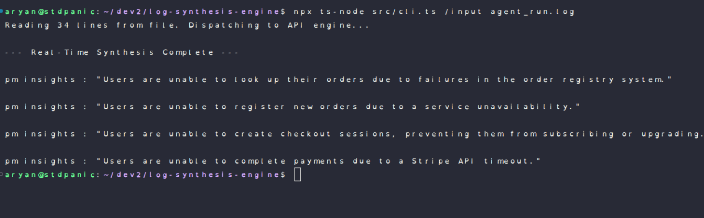
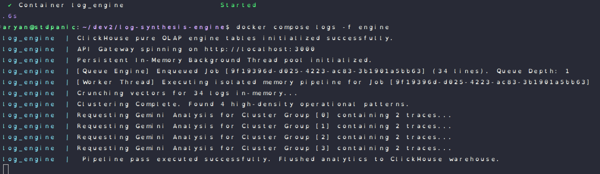

# Scribe : Log Synthesis Engine For AI Agents

A high-performance, agentic conversational log processing pipeline designed to ingest unstructured system log streams, compute dense vector embeddings, and run spatial density matrix clustering generating real-time product management (PM) insights before committing analytics to an OLAP data warehouse.

---

## Deep-Dive Specifications

To evaluate the complete engineering trade-offs, algorithm justifications, and distributed scalability roadmaps, review the detailed deep-dive sub-manifests:

* [**REASONING.md**](./REASONING.md) — High-taste analysis on choosing Columnar OLAP (ClickHouse) over transactional pgvector, picking density-spatial clustering (DBSCAN) over pre-calculated $K$-Means, and managing thread-boundary allocations.
* [**RUNNING.md**](./RUNNING.md) — Step-by-step developer environment runbook covering local Docker Compose container definitions, network initialization steps, and the native TypeScript CLI utility toolkit.
---

## Engine Result & Running Screenshots 

### PM Insights Result

### Engine Running Logs

