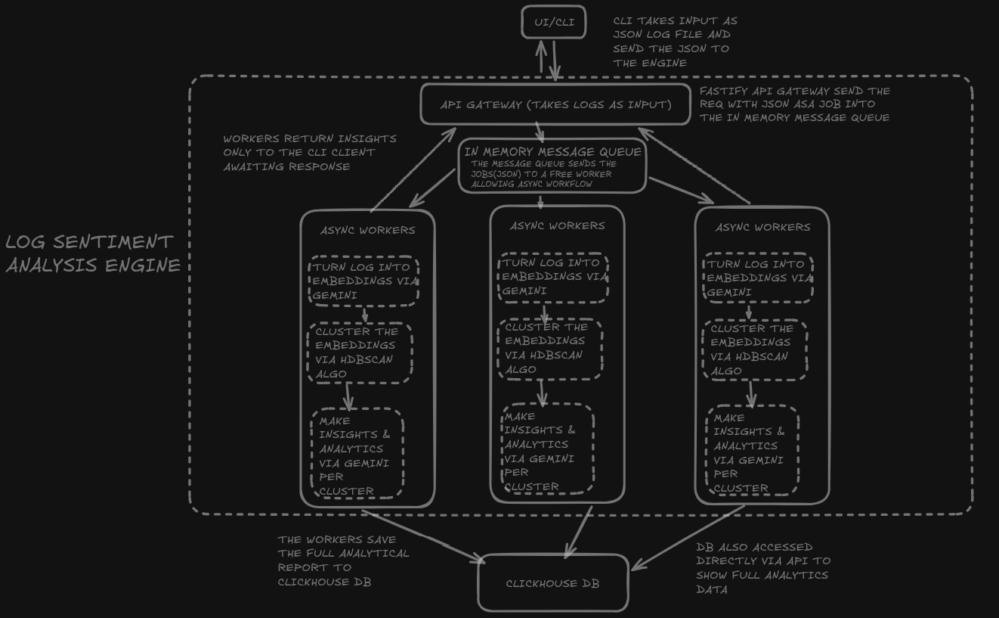

## Core System Architecture

The engine cleanly decouples network ingestion from core execution loops using an optimized, thread-isolated internal message broker. This ensures that heavy physical matrix operations and LLM contexts never block the Node.js event loop.

### End-to-End Execution Flow
1. **Ingress Handshake:** The **Fastify API Gateway** intercepts raw text logs via high-throughput HTTP REST payloads.
2. **Task Enqueueing:** Payload traces are structured into transient transaction objects and pushed down an **In-Memory Message Queue**.
3. **Thread-Isolated Execution:** Persistent background **Async Worker Threads** pull tasks sequentially. 
4. **Vector Clustering Matrix:** Logs are converted into dense vector math coordinates using the `gemini-embedding-2` layer and grouped using density-based spatial clustering (DBSCAN).
5. **AI Synthesis & Capture:** High-density failure patterns are dispatched to `gemini-2.5-flash` to extract business impacts, then flushed as compressed columnar rows into a **ClickHouse DB** data lake.

---
# Architectural Decisions, Taste, & Technical Reasoning

Core technical justifications, algorithmic constraints, and data structure choices behind the **Log Synthesis Engine**. 
---

## 1. Storage: Why ClickHouse

### The Decision
The engine utilizes **ClickHouse** as its absolute source of truth for raw telemetry traces and aggregated topic models, completely bypassing traditional relational databases.

### The Technical Reasoning
Log analytics is a pure **OLAP (Online Analytical Processing)** workload. Telemetry systems write sequentially in massive bursts and execute wide, analytical read-scans across specific columns (e.g., calculating average cluster sizes or searching specific time ranges). And we didn't go for pgvector because we aren't storing the vector embeddings and processing it in-memory , we are not storing the embeddings because in sentiment analysis of conversations we don't need vector search and we are storing data on which we can perform operations on find buisness ideas/breakthroughs.

 ClickHouse groups data on disk by column cells rather than table rows. If a query only reads `label` and `sample_size`, the disk head skips all other data tracks entirely. Because logs feature highly repetitive text strings (e.g., identical stack traces or service tags), ClickHouse achieves immense columnar data compression, dramatically reducing storage footprint and enables very high performance querying.

---

## 2. Algorithmic Modeling: Density-Spatial Grouping (DBSCAN) vs. Centroid Partitioning (K-Means)

### The Decision
The system utilizes **DBSCAN** (Density-Based Spatial Clustering of Applications with Noise) to partition high-dimension coordinate matrices, rejecting standard distance-from-centroid partitioners.

### The Technical Reasoning
In production agent observability, telemetry behavior is highly volatile and completely unpredictable.

* **Why K-Means Fails for Logs:** $K$-Means requires the software engineer to supply an explicit number of target clusters ($K$) prior to execution. In real-time log streaming, it is mathematically impossible to predict how many unique production bugs, service timeouts, or security anomalies will occur in a given time range. If $K$ is set to 4, but 8 seperate types of problems are occuring with a user creating a microservices then the clusterng algorithm will force the 8 to become 4 clusters only leading to poor insights.
* **The DBSCAN Advantage:** DBSCAN operates entirely on spatial density thresholds: a maximum search radius (`epsilon`) and a floor count of proximate coordinates required to construct a valid group (`minPts`). This allows the engine to dynamically discover an arbitrary, fluctuating number of independent topic groups on the fly. 
* **Trade Off : Noise Rejection:** Crucially, $K$-Means forces *every single data point* into a cluster, meaning an isolated, unrelated log trace will skew the entire mathematical centroid. DBSCAN natively classifies isolated, low-density coordinates as **noise outliers**, throwing them out of the pipeline completely. This does mean that only the recurring situations will be given out into insights but this is a better option than K means because it will give less insights but never wrong inights.

---

## 3. Compute Isolation: Thread-Separated Micro-Broker vs. Synchronous Event-Loop Ingress

### The Decision
The application implements an internal asynchronous task pipeline that decouples HTTP ingestion from core computation using **Persistent Node.js Worker Threads**.

### The Technical Reasoning
The Node.js main event loop is strictly single-threaded. While it excels at high-concurrency network I/O handshakes (via `libuv`), it blocks instantly when executing CPU-bound mathematical operations.

* **Preventing Event-Loop Drain:** Compiling dense mathematical coordinate floats, constructing multi-dimensional spatial distance matrices, and waiting for multi-stage external network completions are exceptionally blocking execution paths. Running these workflows synchronously inside standard Fastify request chains would freeze the main event loop, causing incoming network handshakes to timeout and drop.
* **The Worker Pool Interface:** The API Gateway acts purely as a lightweight ingress shell. When a log batch lands, it is assigned a tracking ID, buffered into memory, and instantly offloaded across a clean memory boundary to an isolated Worker Thread. The main thread immediately finishes the client network transaction. The Worker processes the geometric pipeline in total isolation, committing the analytical outputs straight to ClickHouse. The system achieves complete architectural decoupling, allowing ingestion scaling to grow independently of processing velocity.

---
### Run & Test 

* Run & Test the Engine using [**RUNNING.md**](./RUNNING.md) 

